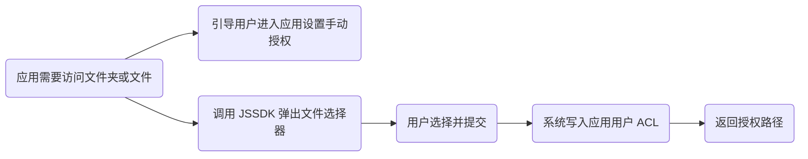
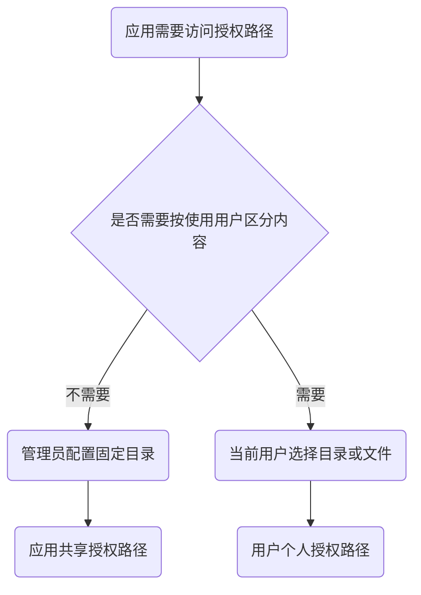
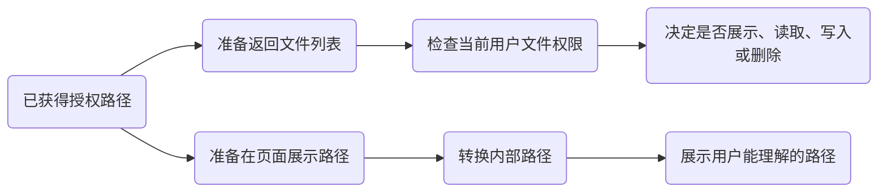

:::warning

应用访问用户存储空间中的文件夹或文件前，需要先获得授权。由于应用服务通常以独立的应用用户运行，不是以当前登录用户运行，系统需要把对应路径的 ACL 权限授予这个应用用户后，应用才能实际访问目标路径。

:::

没有接入授权接口时，应用通常只能引导用户进入应用设置，再由用户手动添加授权目录。接入后，应用可以在自己的页面里直接打开文件夹选择框或文件选择框，让用户完成选择和确认，并直接拿到本次授权结果。

:::note

选择器调用会直接返回本次授权结果。后端查询授权结果主要用于页面刷新、服务重启后重新同步授权状态，或在后端业务中读取当前应用已有的授权路径。

:::

:::warning

拿到授权路径和应用用户 ACL 权限，不代表可以绕过当前使用用户的系统权限。应用仍然需要按当前用户的文件权限决定是否展示、读取、写入或删除内容。

:::

前端 JS SDK 和后端 API 的通用请求方式见 [调用方式](../calling.md)。

## 选择授权方式

按应用的使用方式选择授权入口：

- 不按使用用户区分内容：阅读 [应用共享授权路径](./shared-access.md)。
- 按使用用户提供不同内容：阅读 [用户个人授权路径](./user-access.md)。

前端 JS SDK 用于打开选择或授权界面。后端 API 用于查询授权结果、删除授权路径，以及检查文件权限。

## 相关文件能力

拿到授权路径后，常见还会用到两类文件能力：

- 返回文件列表前，判断当前用户是否有权访问某个路径：阅读 [文件权限检查](./file-acl.md)。
- 在页面上展示路径，把 `/vol1/...` 转成用户能理解的路径：阅读 [路径转换](./path-convert.md)。

## 本页要点

- 应用服务以独立应用用户运行，访问用户文件前需要系统授予应用用户 ACL。
- 选择器调用会直接返回本次授权结果。
- 后端查询授权结果主要用于刷新、服务重启后同步，或后端业务读取已有授权路径。
- 拿到授权路径不代表绕过当前使用用户的系统权限，返回内容前仍建议检查用户权限。

---
